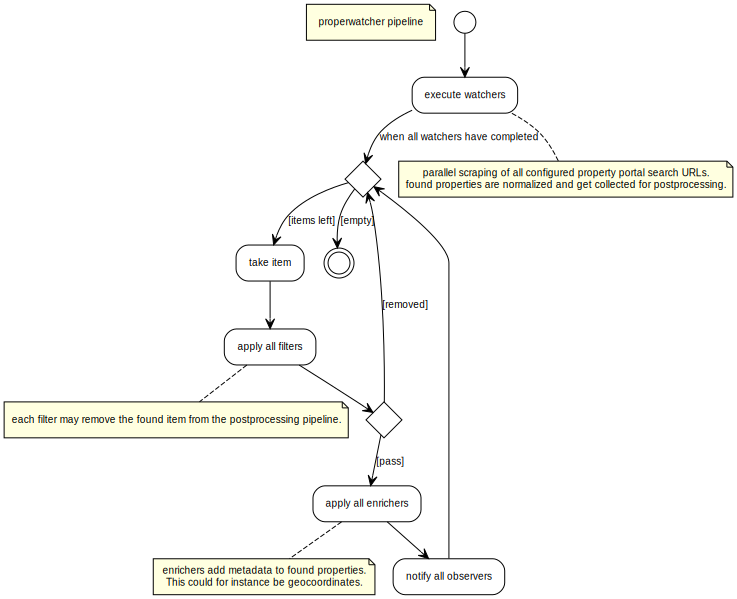

# properwatcher


The _properwatcher_ is a lightweight Rust application that can monitor different property website queries. Found properties are transformed into a normalized representation. Different types of modules can filter (eg. drop already processed items), enrich (eg. add geocoordinates) and observe found properties (eg. send telegram notifications or populate a dabatase). Properwatcher is super fast because websites are loaded asynchronously and scraped in parallel with the help of [Firefox' Servo technology](<https://de.wikipedia.org/wiki/Servo_(Software)>). The tool can be run either from command line, docker image or an AWS lambda function.

## Features

- 🦋 **lightweight**: low on memory and CPU
- ⚡ **fast**: parallel & async website processing using Firefox technology
- 📦 **modular**: modules (watchers, filters, enrichers and observers) can be (de-)activated and extended easily
- ☁️ **lambda support**: easy to use as an AWS lambda function and can be reliably scheduled via EventBridge
- 👶 **easy to setup**: configure custom searches on the propery portals and then use resulting URLs
- 📣 **be the first to know**: define notifications and know about new properties immediately once they are available

## Getting Started

To get you started quickly, there's a tutorial available explaining incrementally how you can use free tier AWS functionality to schedule runs of the properwatcher tool to get instant notifications, as soon as new properties become available.

You [find the getting started tutorial here](tutorial/0_intro.md).

## Modules

### Watchers (crawlers)

> Watchers can scrape property portal URLs and extract offers into a normalized form. Those extracted entries will then get postprocessed.

- **immoscout**: ImmobilienScout24
- **wohnungsboerse**: Wohnungsboerse
- **sueddeutsche**: Immobilienmarkt Süddeutsche Zeitung
- **wggesucht**: WG Gesucht
- **immowelt**: ImmoWelt

### Filters

> Filters look at each extracted entry and may remove it, before it gets enriched or observed. This could be, because it has already been processed in the past or it is not interesting in any way.

- **dynamodb**: checks if the item already exists in the configured DynamoDb
- **csv**: checks if the item has already been written to the configured csv
- **criteria**: filter properties for price, size and number of rooms

### Enrichers

> Enrichers may match additional information to the extracted entries. This could be geocoordinates, detail URLs etc.

- **nominatim**: geocoordinates powered by OpenStreetMap

### Observers

> Observers get notified once new entries have been found.

- **telegram**: Sends messages to any Telegram chat
- **mail**: Sends mails via SMTP
- **csv**: Append directly to CSV file for offline analytics
- **dynamodb**: Insert found entries into the configured DynamoDb table
- **debug**: Print every observation in readable format to stdout

## Usage

### Configuration File

#### TOML

Settings and property queries that should be watched have to be defined in a configuration file. propertywatcher by default looks for a file called `config.toml` that resides in the same directory as the tool is run from. A sample configuration file can be found in this repository and is named [config.sample.toml](/config.sample.toml). You can create a copy and adjust it to your needs. Pay special attention to the [`watcher` section](config.sample.toml#L21). This section can be given multiple times and will tell properwatcher, where to look for new flats/houses.

#### JSON

In case of a lambda function, you'll need to translate the toml configuration into JSON. All attributes are called the same, except the _watcher_ section, which is called _watchers_ in the JSON representation of the config.

### via CLI

`./properwatcher [<path-to-config-file>]`

If the config file path parameter is left out, the binary will look for a file called `config.toml` in the current working directory.

### via Docker

Once you have created a valid configuration file, you can run properwatcher via the provided docker image. The properwatcher command takes an optional location for a configuration file as first parameter. We'll use this fact in the following command to refer to our mounted config file that locally resides in `/home/flo/config.toml`.

```bash
docker run -d --restart on-failure -v /home/flo/config.toml:/opt/properwatcher.toml --name properwatcher floschnell/properwatcher /opt/properwatcher.toml
```

### via AWS Lambda

Create AWS Lambda function from the provided zip package (see Releases page). Configuration is done via JSON input. The provided toml configuration file can be used as blueprint. An example of a JSON configuration for the AWS Lambda would be:

```json
{
  "thread_count": 1,
  "watchers": [
    {
      "address": "https://www.immobilienscout24.de/Suche/de/bayern/muenchen-kreis/wohnung-mieten?enteredFrom=one_step_search",
      "city": "Munich",
      "crawler": "immoscout",
      "property_type": "Flat",
      "contract_type": "Rent"
    }
  ],
  "filters": ["dynamodb"],
  "enrichers": ["nominatim"],
  "observers": ["dynamodb"],
  "dynamodb": {
    "table_name": "properties",
    "region": "eu-central-1"
  }
}
```

In the above case all found items would be stored in the configured DynamoDb table. The _dynamodb_ filter would remove items, that already exist in the database. So the _nominatim_ enricher would only process the items, that have not yet been seen by the properwatcher.

#### DynamoDb credentials

Using the DynamoDb observer from the Lambda function is very easy. Simply grant access to the database from the lambda's role in AWS IAM.

## Development

### Pipeline



### Compile for your system

If not yet done, setup your rust environment via `rustup` [as described here](https://www.rust-lang.org/tools/install).

After that you can clone this repository and within the root folder, run `cargo run` to quickly compile and run the current source code.

To build a release optimized version of the code, run `cargo build --release`.

### Build for AWS lambda

From the root of the project, run:

```bash
docker run --rm \
    -v ${PWD}:/code \
    -v ${HOME}/.cargo/registry:/root/.cargo/registry \
    -v ${HOME}/.cargo/git:/root/.cargo/git \
    softprops/lambda-rust
```

The resulting zip archive should reside in `target/lambda/release` and can be used with AWS lambda right away.

The used lambda library for Rust [gives more information on how it can be used from docker](https://github.com/awslabs/aws-lambda-rust-runtime#docker).
